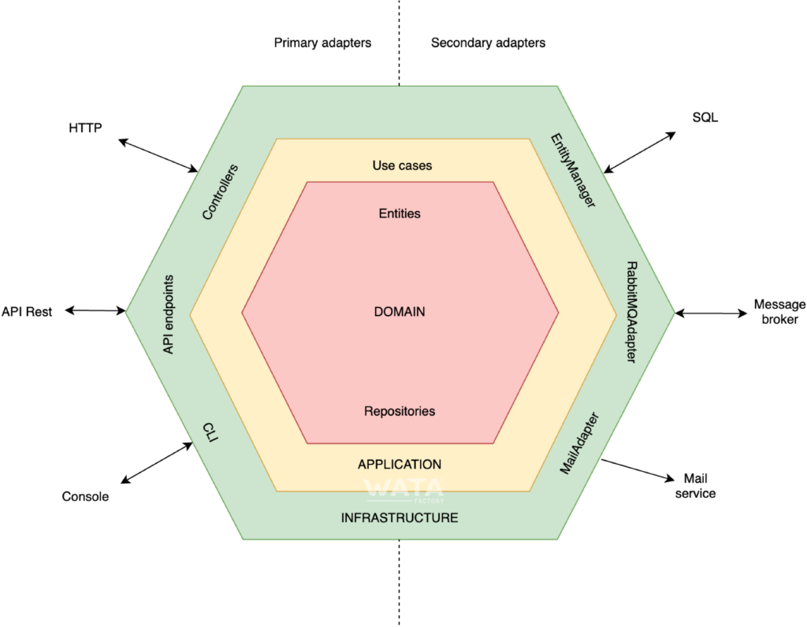

# back-end-demo

## Description
This is a simple REST API using:
* Node.js and Express.js.
* Typescript as language.
* Mongoose for data mangement.
* Jest for unit tests.
* Docker for an easy deployment.
* MongoDB as database.

## Server structure
I'm using an hexagonal architecture in order to get a loosely coupled application. This makes that the external components as the controllers or the repository implementations can be replaced easily, for example, to change from mongoDB to MySQL just create a repository implementation that implements it's repository interface and initialize the server with that implementation. 



The controllers are the HTTP adapters.
The services the use cases logic layer.
The repositories the domain layer.
The repository implementations the persistence adapter thanks to the dependency inversion principle.

## Usage:
To deploy the server with a mongo instance, docker and docker-compose are required. Then execute:
```bash
docker-compose up --build -d
```
The server is listening on port 3000 by default, to change it edit backend/config/default.js
The mongo server is listening on port 27017

To stop the services use:
```bash
docker-compose down -v
```

## Deployment in a production or pre-production environment:
The server can be easily deployed into a kubernetes cluster. Just upload the docker image to a docker registry and deploy it in the cluster. This will be easier if environment vars were used in the server configuration.